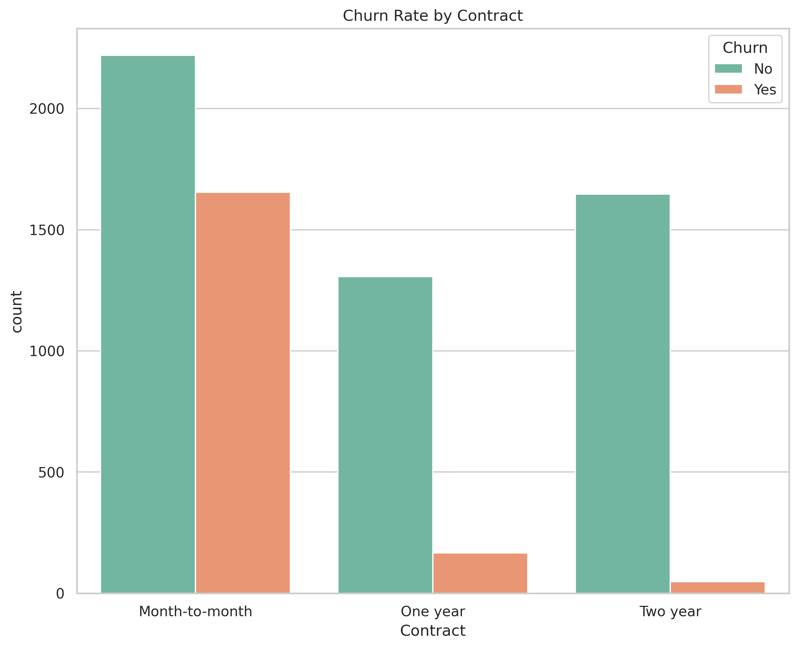
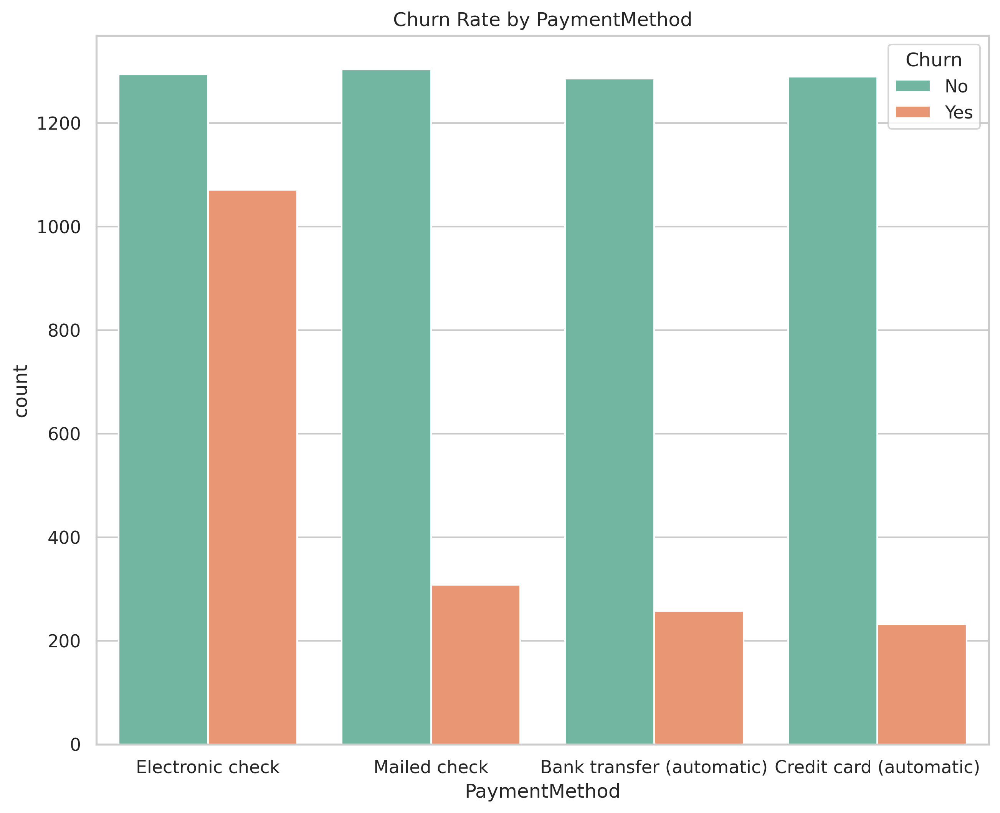
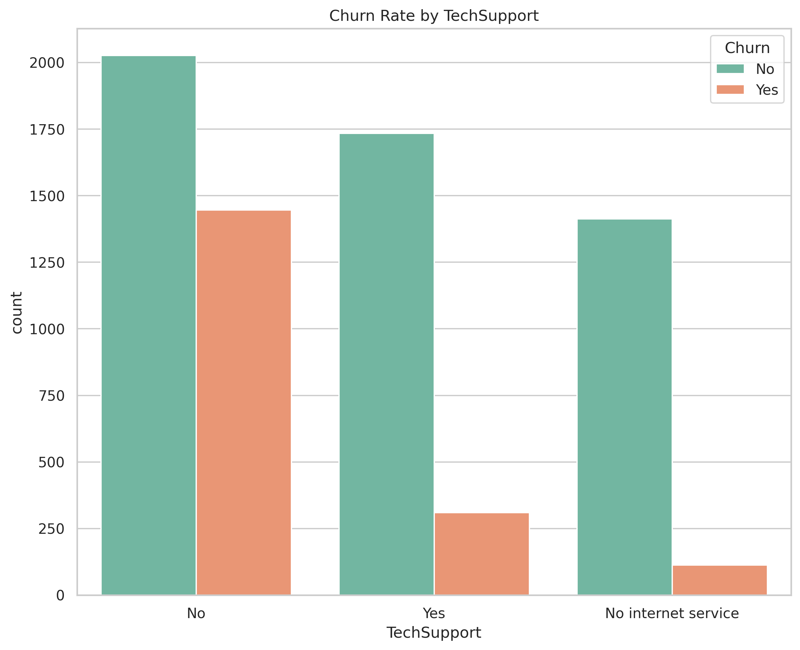
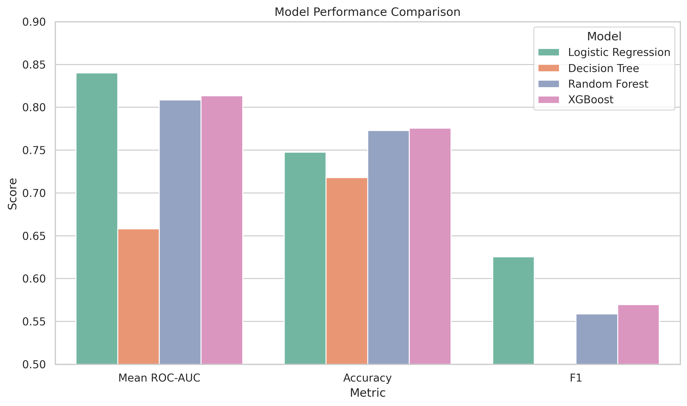

# 💼 Customer Churn Analysis and Retention Strategy for a Telecom Company

### 📝 Overview
This project analyzes customer churn behavior for a telecom company and develops data-driven strategies to improve customer retention.  
It combines exploratory data analysis, predictive modeling, and business insight generation to identify high-risk customer segments and recommend targeted interventions.

---

### 💸 Business Objective
Customer churn is a critical metric for subscription-based businesses. The goal of this project is to:
- Identify key drivers behind customer churn.
- Build predictive models to estimate churn probability.
- Provide actionable recommendations to reduce attrition and increase customer lifetime value.

---

### 🗃️ Data
Available at : https://www.kaggle.com/datasets/blastchar/telco-customer-churn

---

### 🗂️ Project Structure

```bash
Customer_churn_predictor/
├── CCP.ipynb                                     # Main notebook (analysis & modeling)
├── app
│   └── Dashboard.py                              # Streamlit dashboard (executive summary)
├── images                                        # Plots and visual assets
│   ├── Churn_drivers.png
│   ├── Correlation_Matrix.png
│   ├── Customer_churn_by_contract.png
│   ├── Customer_churn_by_dependent.png
│   ├── Customer_churn_by_deviceprotection.png
│   ├── Customer_churn_by_gender.png
│   ├── Customer_churn_by_internetservice.png
│   ├── Customer_churn_by_multiplelines.png
│   ├── Customer_churn_by_onlinebackup.png
│   ├── Customer_churn_by_onlinesecurity.png
│   ├── Customer_churn_by_paperlessbilling.png
│   ├── Customer_churn_by_partner.png
│   ├── Customer_churn_by_paymentmethod.png
│   ├── Customer_churn_by_phoneservice.png
│   ├── Customer_churn_by_seniorcitizen.png
│   ├── Customer_churn_by_streamingmovies.png
│   ├── Customer_churn_by_streamingtv.png
│   ├── Customer_churn_by_techsupport.png
│   ├── Customer_churn_by_tenure_group.png
│   ├── Customer_churn_rate.png
│   ├── Model_performance.png
│   ├── Monthly_charges.png
│   ├── Monthly_charges_boxplot.png
│   ├── Tenure_boxplot.png
│   └── Tenure_distribution.png
├── log_reg_churn_pipeline.pkl                    # Model saved as pipeline for future prediction
├── requirements.txt                              # Python dependencies            
└── README.md                                     # Project overview and documentation                
```

---

### 🧰 Approach

| Phase | Description |
|-------|--------------|
| **1. Data Preparation** | Cleaned and transformed telecom customer dataset (handled missing values, categorical encoding, and data type corrections). |
| **2. Exploratory Data Analysis (EDA)** | Analyzed customer demographics, contract types, payment methods, and service usage to uncover churn patterns. |
| **3. Feature Engineering** | Created new variables (e.g., tenure categories) and addressed class imbalance using SMOTE. |
| **4. Modeling** | Trained multiple machine learning models (Logistic Regression, Random Forest, Decision Tree, XGBoost Classifier) to predict churn. |
| **5. Evaluation** | Compared models using Accuracy, Recall (Churn class), and F1 score. |
| **6. Business Insights** | Translated model results into strategic recommendations for retention. |

---

### 💡 Key Insights

| Area | Observation | Business Interpretation | |
|------|--------------|-------------------------|-------------------------|
| **Contract Type** | Month-to-month customers churn far more than those with yearly contracts. | Offer discounts for annual plans to increase retention. ||
| **Payment Method** | Electronic check users churn at higher rates. | Investigate friction in payment experience; promote auto-pay or credit options. ||
| **Customer Tenure** | Early-life customers (first 12 months) are at highest risk. | Implement onboarding campaigns or loyalty rewards for new users. ||
| **Tech Support / Online Security** | Lack of these services strongly correlates with churn. | Bundle these services as value-add features. ||

---

### 📈 Modeling Results


| Model | ROC-AUC | Accuracy | 
|--------|----------|----------|
| **Logistic Regression** | **0.86** | 0.75 |
| Random Forest | 0.83 | 0.80 |
| XGBoost | 0.84 | 0.79 |
| Decision Tree | 0.69 | 0.74 |



**Interpretation:**  
- Selected Model: Logistic Regression
- Reason: Offers transparent insights into feature influence, business interpretability, and stable generalization.

---

### 💡 Strategic Recommendations
- Introduce **loyalty incentives** for short-tenure customers.  
- Offer **contract upgrades** and discounts for switching from month-to-month to yearly plans.  
- Promote **bundled packages** that include online security and tech support.  
- Target **electronic check users** with alternative payment offers.  

---

### 🚀 Deployment Readiness

The trained churn model has been saved as a **`.pkl` pipeline** that includes:
- Data preprocessing (scaling, encoding, and balancing)
- The trained logistic regression model
- All transformation logic for inference

This allows business users or data engineers to seamlessly deploy the model without needing to repeat preprocessing.

**Example usage:**
```python
import joblib
model = joblib.load("log_reg_churn_model.pkl")

# Predict churn probability for new customer
sample = Customer_Data
prob = model.predict_proba(sample)[0, 1]
print(f"Predicted churn probability: {prob:.2f}")
```

---

### 🔧 Tools & Technologies
- **Python**: pandas, numpy, matplotlib, seaborn, scikit-learn, imbalanced-learn, xgboost  
- **Modeling**: Logistic Regression, Random Forest, Decision Tree, XGBoost Classifier 
- **Visualization**: seaborn, matplotlib  
- **Environment**: Jupyter Notebook  
- *(Next step: Streamlit dashboard for executive summary)*

---

### 👤 Author
**[Rishabh Bubna]**  
Data Scientist | Business Analytics Consultant  
📧 rishabh.bubna.3012@gmail.com
🔗 [LinkedIn Profile](https://www.linkedin.com/in/rishabh-bubna-304bb3172)

---
